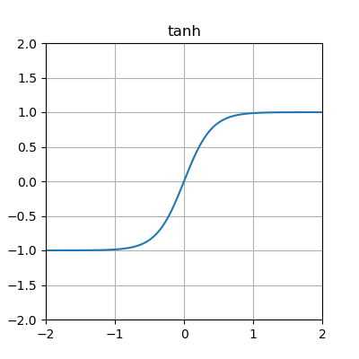

# Testing Ehe Effect of Different Activation Functions on Machine Learning Models

## Introduction
This experiment will test the effect of different activation functions on a machine learnig model. The functions will be tested on a machine learning model that is learning how to drive around a track with 5 inputs. The functions that will be tested are the sigmoid, Rectified Linear Unit (ReLU), Hyperbolic Tangent (Tanh), clamped. The average fitness of generations 3, 5, 10, 20 30, 40, 50 will be recorded. This will asses the best function for this application.

### Independent variable
For this experiment the independent variable is the activation function. This experiment uses the sigmoid function, rectified linear unit function, hyperbolic tangent function, and the clamped function. These functions are shown below.

>Sigmoid

>Rectified Linear Unit

>Hyperbolic Tangent

>Clamped

### Dependent variable
The fitness of the car is being measured and the higher the value the better the score. The fitness is calculated based on the distance the car has gone in the time taken. There is a limited time that a generation ends however this is why distance is important as it means the faster the car goes the higher the fitness score.
## Method
1. Download this repository and open the `newcar.py` file. The default function is the sigmoid function.
2. Install the required libraries including `neat-python` and `pygame`
3. Run the python file and wait until the generation counter reaches 52 then quit the application
4. In the terminal locate the 3rd, 5th, 10th, 20th, 30th, 40th and 50th generations and record the average fitness for each of these generations
5. Repeat steps 3 and 4 but open the `config.txt` file and change the values of `activation_default` and `activation_options` to be `relu` on the first repeat `tanh` on the second and `clamped` on the third
6. Repeat steps 3, 4 and 5 three times to get an accurate result.

## Results

### Graphs
Trial 1:

Trial 2:

Trial 3:

These results highlight the unpredictable and random behaviour of this learning model. The results vary greatly from trial to trial however we can see that the sigmoid function especially has a constant upward trend. This indicates that if it were run for more generations then it would produce a better outcome. ReLU was the least predictable, in the first trial it had the highest final score however in the second two trials it had the lowest. The clamped function achieved the highest score however for 2 of the 3 trials it was trending down. The different functions managed to achieve similar scores, none could be said to be better in all cases however in this scenario the sigmoid function was the most stable with a clear upward trend and the clamped function achieved the highest score. 

## Conclusion
These different functions have different uses and although the sigmoid function was the most stable in this example the same cannot be said for every case. Different functions have different output ranges for instance the sigmoid function is between 0 and 1 however the tanh function is between -1 and 1. Exponential functions can also slow down the training process as they are more computationally expensive which isn't a problem on a small scale such as this experiment however when scaled up this can have a meaningful effect on the outcome and the time taken. Due to these differences between functions it is vital to weigh the importance of different factors in the application of the machine learning algorithm and choose a function that suits these factors the best. 

## References
Tam, A 2023, Using Activation Functions in Deep Learning Models - MachineLearningMastery.com, MachineLearningMastery.com, viewed 8 September 2023, <https://machinelearningmastery.com/using-activation-functions-in-deep-learning-models/>.

SHARMA, S 2017, Activation Functions in Neural Networks - Towards Data Science, Medium, Towards Data Science, viewed 9 September 2023, <https://towardsdatascience.com/activation-functions-neural-networks-1cbd9f8d91d6>.

Activation functions in Neural Networks 2018, GeeksforGeeks, GeeksforGeeks, viewed 9 September 2023, <https://www.geeksforgeeks.org/activation-functions-neural-networks/>.

Activation functions in neural networks [Updated 2023] | SuperAnnotate 2023, Superannotate.com, viewed 10 September 2023, <https://www.superannotate.com/blog/activation-functions-in-neural-networks>.

‌
‌
‌

‌
